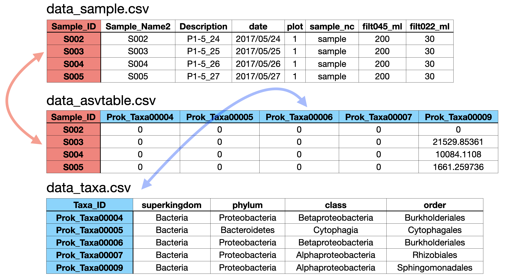

# R and shell scripts for Ushio (in press) _Proceedings of the Royal Society B_
R and shell codes to reproduce the results in Ushio M (in press) "Interaction capacity as a potential driver of community diversity" _Proceedings of the Royal Society B_.

(Preprint: "Interaction capacity underpins community diversity" _bioRxiv_ https://doi.org/10.1101/2020.04.08.032524)

**Note**: In this repository, only core result files are included due to the file size limitation. You may reproduce the main figures using the information available in this repository, but if you want to reproduce the full results, please re-run all analyses using DNA sequence data (deposited in DDBJ; see the bottom of this README) or contact the author (ong8181@gmail.com).

# License
see LICENSE

# Core softwares
- `Claident` (https://www.claident.org/)
- `DADA2` (https://benjjneb.github.io/dada2/index.html)
- `rEDM` (https://ha0ye.github.io/rEDM/index.html)
- Regularized S-map (custom scripts) (https://github.com/ong8181/random-scripts/tree/master/02_RegularizedSmap)

# Analysis workflow
## No.1: Sequence analysis
`01_DNAtsCERrice2017` folder includes R and shell scripts for analyzing DNA sequences  
1. Sequence data (fastq files) generated by MiSeq was analyzed using `Claident` and `dada2`
    - Amplicon Sequence Variants (ASVs) were picked up by DADA2
    - Taxa were assigned by `Claident`
2. Sequence reads were converted to DNA copy numbers
    - `02_TimeSeriesCompile` folder
 
## No.2: Empirical dynamic modeling
`02_EcolComAnalysis` folder includes R scripts for nonlinear time series analysis (Empirical dynamic modeling).

## No.3: Meta-analysis
`03_MetaAnalysis` folder includes R scripts for the meta-analysis. The data for the meta-analysis were collected by contacting authors of the original publications, and thus are not included in the repository.

## No.4: Quantitative metabarcoding v.s. other quantification methods
`04_QunatifyDNA` folder includes R scripts to compare the quantitative capacity of quantitative metabarcoding v.s. other quantification methods.

## No.5: Quantitative metabarcoding v.s. Shotgun metagenome analysis
`05_ShotgunMetagenome` folder includes codes to compare the community compositions detected by quantitative metabarcoding and shotgun metagenome analysis.

## No.6: Additional analyses
`06_AdditionalAnalysis` folder includes codes for the additional statistical analyses.

## No.7: Visualization
`07_EcoNetFigs` folder includes codes to create figures mainly using `ggplot2`.

# Core data
In `data_compiled` folder, compiled versions of climate data, DNA-based community data, sequence summary, and RData file are prepared for those who want to view and re-use the data. Please read `README.txt` for the information about the data included in CSV files.

If you are familiar with `R` and `phyloseq` package (https://joey711.github.io/phyloseq/), executing the following code is the easiest way to re-use or view the core data. 
```
load("data_compiled.RData")

# This loads the following objects in R
## data_asv = "data_asvtable.csv"
## data_climate = "data_climate.csv"
## data_sample = "data_sample.csv"
## data_taxa = "data_taxa.csv"
## phyloseq_obj = phyloseq object that includes data_asv, data_sample, and data_tax
## regularized_smap_results = Jacobian matrix inferred using regularized, multivaraite S-map (this is a large object)
```

Alternatively, you may download `data_asvtable.csv`, `data_sample.csv`, and `data_taxa.csv`, and excute the following R script.

```
# Load phyloseq
library(phyloseq)

# Load csv data
data_asv <- read.csv("data_asvtable.csv", row.names = 1)
data_sample <- read.csv("data_sample.csv", row.names = 1)
data_taxa <- read.csv("data_taxa.csv", row.names = 1)

# Check data size and column/row names
dim(data_asv); dim(data_sample); dim(data_taxa)
all(rownames(data_asv) == rownames(data_sample))
all(colnames(data_asv) == rownames(data_taxa))

# Import to phyloseq
ps_all <- phyloseq(otu_table(data_asv, taxa_are_rows = FALSE),
                   sample_data(data_sample),
                   tax_table(as.matrix(data_taxa)))
```

The structure of the csv files are as follows: rownames of `data_asvtable.csv` equal to rownames of `data_sample.csv`, and colnames of `data_asv.csv` equal to rownames of `data_taxa.csv`.



# Sequence data
You may download sequence data (`*.fastq.bz2`) from DDBJ Sequence Read Archives (DRA) by executing the following commands. `XXXXXXXXX` should be DRA accession number for each MiSeq run: 16S data = DRA009658, ITS data = DRA009659, COI data = DRA009660, and 18S data = DRA009661.

```
# Prepare folders
cd ~/Desktop
mkdir temp
cd temp
mkdir xml

# Download data
wget -r ftp://ftp.ddbj.nig.ac.jp/ddbj_database/dra/fastq/DRA009/XXXXXXXXX/

# Move files
mv ftp.ddbj.nig.ac.jp/ddbj_database/dra/fastq/DRA009/XXXXXXXXX/*/*.fastq.bz2 ./
mv ftp.ddbj.nig.ac.jp/ddbj_database/dra/fastq/DRA009/XXXXXXXXX/*.xml xml

# Delete temporal folder
rm -r ftp.ddbj.nig.ac.jp

# Convert bz2 to gz format
#for f in *.bz2; do bzcat "$f" | gzip -c >"${f%.*}.gz"; done
#rm *.bz2
```


